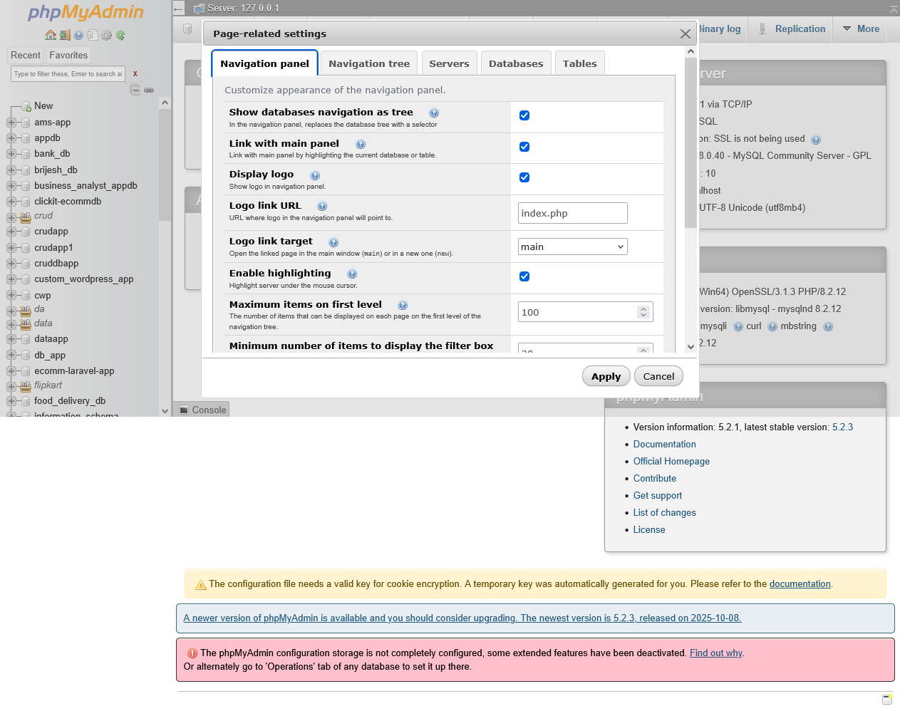

# SQL 
1. stands for structured query language 
2. sql is used to create database and tables structured 
3. sql create a structured of database and tables 
4. sql is case insenstive language 
5. sql create and provides relationship b/w tables 
6. table can contain row and column 

# type of query in SQL 

1. DDL (data definition language)
2. DML (data manipulation language)
3. DQL (data query language)
4. TCL (transactional query language)


# how to install xampp for database practised 

https://www.apachefriends.org/

1. open xampp=>xamp control panel 
2. open or start apache server
3. mysql server 
4. open broswer 
5. http://localhost/phpmyadmin/




# DDL (data definition language)
1. create the structured od database 
2. create the structured of tables 
3. after create tables alter | change | rename 

# DDL query are ...

1. create 
2. alter 
3. rename 
4. change 
5. drop 
6. truncate 

# how to create a database using SQL ...

**syntax**

```
create database databasename;
or
create database flipkart_db_app;

```

# how to create tables inside database

**syntax**

```
create table tablename
(
columnname datatype(size) primary key,
.
.
.
columnname datatype(size) 
)
or
create table users(

uid int primary key AUTO_INCREMENT,
name varchar(200),
password varchar(255),
gender varchar(255),
hobby varchar(200),
mobile bigint
)
```


# create a tables all column data types and size

The examples below use MySQL data types. A type's **storage size** is different
from its declared capacity. For example, `INT(11)` still uses 4 bytes; `11`
was a display width, not the number of bytes or the allowed number of digits.
Integer display widths are deprecated/ignored in modern MySQL (except legacy
`ZEROFILL` behavior).

## Numeric data types

| Type | Size / capacity | Notes |
|---|---:|---|
| `TINYINT` | 1 byte | Signed: -128 to 127; `UNSIGNED`: 0 to 255 |
| `SMALLINT` | 2 bytes | Signed: -32,768 to 32,767; `UNSIGNED`: 0 to 65,535 |
| `MEDIUMINT` | 3 bytes | Signed: -8,388,608 to 8,388,607; `UNSIGNED`: 0 to 16,777,215 |
| `INT` / `INTEGER` | 4 bytes | Signed: -2,147,483,648 to 2,147,483,647; `UNSIGNED`: 0 to 4,294,967,295 |
| `BIGINT` | 8 bytes | Signed: -2^63 to 2^63-1; `UNSIGNED`: 0 to 2^64-1 |
| `DECIMAL(M,D)` / `NUMERIC(M,D)` | Variable | Exact value; `M` is up to 65 total digits and `D` is up to 30 decimal places. Storage depends on the digits. |
| `FLOAT` | 4 bytes | Approximate, single-precision value |
| `DOUBLE` / `DOUBLE PRECISION` / `REAL` | 8 bytes | Approximate, double-precision value |
| `BIT(M)` | 1 to 64 bits | `M` is 1-64; storage is `CEILING(M / 8)` bytes |
| `BOOL` / `BOOLEAN` | 1 byte | Alias for `TINYINT(1)`; conventionally 0 is false and 1 is true |

`UNSIGNED` is available for integer and `DECIMAL` types, but not for `FLOAT`
or `DOUBLE`. Use `DECIMAL` for exact values such as currency; floating-point
types can have rounding differences.

## Date and time data types

| Type | Storage size | Capacity / notes |
|---|---:|---|
| `DATE` | 3 bytes | `1000-01-01` to `9999-12-31` |
| `TIME[(fsp)]` | 3-6 bytes | `-838:59:59` to `838:59:59`; `fsp` (fractional seconds precision) is 0-6 |
| `DATETIME[(fsp)]` | 5-8 bytes | `1000-01-01` to `9999-12-31`; `fsp` is 0-6 |
| `TIMESTAMP[(fsp)]` | 4-7 bytes | Stored in UTC and converted to/from the session time zone; `fsp` is 0-6 |
| `YEAR` | 1 byte | Year 1901-2155 or 0000 |

Fractional seconds precision adds 0-3 bytes to `TIME`, `DATETIME`, and
`TIMESTAMP`. The supported `TIMESTAMP` range depends on the MySQL version.

## String and binary data types

| Type | Declared capacity | Storage / notes |
|---|---:|---|
| `CHAR(M)` | 0-255 characters | Fixed-length; bytes used depend on the character set |
| `VARCHAR(M)` | Up to 65,535 bytes per row | Variable-length; actual maximum depends on character set and the total row size |
| `BINARY(M)` | 0-255 bytes | Fixed-length binary data |
| `VARBINARY(M)` | Up to 65,535 bytes per row | Variable-length binary data; actual maximum depends on the total row size |
| `TINYTEXT` | 255 bytes | Variable-length text |
| `TEXT` | 65,535 bytes (about 64 KiB) | Variable-length text |
| `MEDIUMTEXT` | 16,777,215 bytes (about 16 MiB) | Variable-length text |
| `LONGTEXT` | 4,294,967,295 bytes (about 4 GiB) | Variable-length text; practical limits also apply |
| `TINYBLOB` | 255 bytes | Variable-length binary data |
| `BLOB` | 65,535 bytes (about 64 KiB) | Variable-length binary data |
| `MEDIUMBLOB` | 16,777,215 bytes (about 16 MiB) | Variable-length binary data |
| `LONGBLOB` | 4,294,967,295 bytes (about 4 GiB) | Variable-length binary data; practical limits also apply |
| `ENUM('value1', ...)` | Up to 65,535 values | Stores one value from the list; uses 1 or 2 bytes |
| `SET('value1', ...)` | Up to 64 values | Stores any combination of listed values; uses 1-8 bytes |

`CHAR` and `VARCHAR` capacities are in characters, while `TEXT` and `BLOB`
limits are in bytes. Multi-byte character sets can use more than one byte per
character. `VARCHAR`, `VARBINARY`, `TEXT`, and `BLOB` also need length
information in storage.

## Other data types

| Type | Size / capacity | Notes |
|---|---:|---|
| `JSON` | Variable; maximum document size is limited by `max_allowed_packet` | Validated JSON stored in an optimized binary format |
| `GEOMETRY` | Variable | Base spatial type |
| `POINT` | Variable | Spatial point |
| `LINESTRING` | Variable | Spatial line |
| `POLYGON` | Variable | Spatial polygon |
| `MULTIPOINT` | Variable | Collection of points |
| `MULTILINESTRING` | Variable | Collection of lines |
| `MULTIPOLYGON` | Variable | Collection of polygons |
| `GEOMETRYCOLLECTION` | Variable | Collection of spatial values |

Spatial data size depends on the geometry's contents; it has no single fixed
size. `SERIAL` is a shorthand for `BIGINT UNSIGNED NOT NULL AUTO_INCREMENT
UNIQUE`, not a separate storage type.

## Example: create a table

```sql
CREATE TABLE users (
    uid INT UNSIGNED NOT NULL AUTO_INCREMENT,
    name VARCHAR(100) NOT NULL,
    password_hash VARCHAR(255) NOT NULL,
    birth_date DATE,
    balance DECIMAL(10, 2) NOT NULL DEFAULT 0.00,
    is_active BOOLEAN NOT NULL DEFAULT TRUE,
    created_at TIMESTAMP NOT NULL DEFAULT CURRENT_TIMESTAMP,
    PRIMARY KEY (uid)
);
```

Choose a type based on the kind and maximum size of the data. For example, use
`VARCHAR` for names, `DECIMAL` for exact money values, and `DATE`/`DATETIME`
for dates and times. Use `NOT NULL`, `DEFAULT`, and constraints where the
column's rules require them.


# create another tables 

```

create table feedback(

feedbackid int AUTO_INCREMENT primary key,
name varchar(255),
email varchar(255),
mobile bigint,
comment text,
added_date datetime    
)
```

# how to rename tables 

**syntax**

```
rename table users to tbl_users;
or

rename table feedback to tbl_feedback;
```