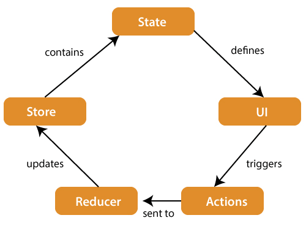

# what is Redux in React js  ?
1. redux is an library of react js 
2. redux used for manage state inside of react 
3. redux is used for state management 
4. redux used for handel a complex structures or projects 
5. Redux is used to manage state-management library used to manage application state in a centralized store.

## redux life cycle phase 

1. state 
2. UI 
3. Action 
4. Reducer
5. store 
6. state


## life cycle architecture of redux 




## advantage of using redux 

- redux is useful for when state is shared by many components
- redux provides its toolkit 
- redux provides stores where all stored data just like a **brain**
- redux provides its own stores when redux is install in react js 


## how to install redux in react js ?

  step - 1: chk npm or npx 
  step - 2: chk npm -v
  step - 3: npm create vite@latest  redux-vite-app
  step - 4: npx create-react-app demo-app redux redux-toolikit
  **or**
  step - 5: npm install @reduxjs/toolkit axios react-redux redux-saga react-icons react-bootstrap bootstrap
## redux directory or life cycle flow 
1. user interacts with UI
2. components dispatches action
3. Middleware recieves action
4. Reducer processes action 
5. Stores updates state
6. React redux detects changed state
7. components re-renders

## how to create a app or redux directory structures 

```
redux-vite-app
|
|----public/
|----src/
|    |----app/
|    |   |--store.jsx
|    |
|    |----features/
|    |    |  |----counter/
|    |    |  |----counterSlice.jsx      
|    |    |--users/ 
|    |       |----userSlice.jsx
|    |       |----userSaga.jsx    
|    |----saga/
|    |   |----rootSaga.jsx
|    |
|    |----services/
|    |    |---api.jsx
|    |----components/
|    |    |---Counter.jsx
|    |----App.jsx
|    |----main.jsx
| 
|
|-----package.json
|-----vite.config.js
|   
```


