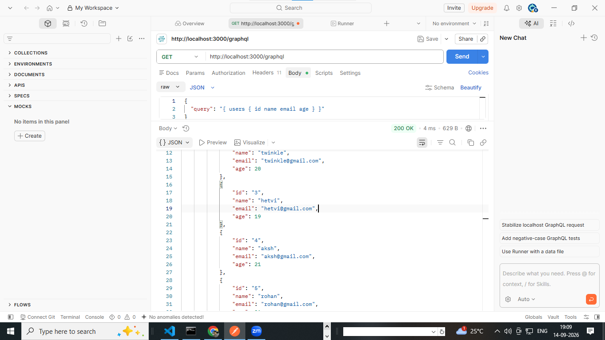

 # GraphQL: Definition and Installation Guide

## What is GraphQL?

GraphQL is a query language for APIs and a runtime that executes those queries against a server-side type system. It was created by Facebook in 2012 and released publicly in 2015.

With GraphQL, the client asks for exactly the fields it needs. The server validates the request against a schema and returns a predictable JSON response.

GraphQL is not a database. It is an API layer that can combine data from databases, REST APIs, files, or other services.

## Why use GraphQL?

- **Request exactly what is needed:** Avoid downloading unused fields.
- **Combine related data:** Fetch connected resources in one request.
- **Strong typing:** The schema defines valid operations and data types.
- **One API endpoint:** Most GraphQL servers expose one endpoint such as `/graphql`.
- **Self-documenting API:** Tools can inspect the schema and provide autocomplete.
- **Versioning is often simpler:** Fields can be deprecated instead of creating many API versions.

## GraphQL vs REST

| GraphQL | REST |
| --- | --- |
| Usually one endpoint | Usually many endpoints |
| Client selects response fields | Server usually controls the response shape |
| Strong schema and type system | May use OpenAPI or other documentation |
| Queries, mutations, and subscriptions | Commonly GET, POST, PUT, PATCH, and DELETE |
| Can fetch related data in one operation | May require several requests |

GraphQL does not automatically replace REST. REST is often simpler for file downloads, caching through HTTP, and small APIs. Choose the approach that fits the application.

## Important GraphQL definitions

### Schema

The schema is the contract between the client and server. It describes available types, fields, arguments, queries, mutations, and subscriptions.

Example:

```graphql
type User {
	id: ID!
	name: String!
	email: String!
}

type Query {
	users: [User!]!
	user(id: ID!): User
}
```

### Type

A type describes the shape of data. GraphQL has built-in scalar types:

- `String`: Text
- `Int`: A signed 32-bit integer
- `Float`: A floating-point number
- `Boolean`: `true` or `false`
- `ID`: A unique identifier, serialized as a string

You can define object types such as `User`, `Product`, or `Order`.

### Field

A field is a property that can be requested from a type. In `User`, `name` and `email` are fields.

### Non-null operator (`!`)

`String!` means the field must return a string and cannot be `null`.

### List operator (`[]`)

`[User]` means a list of users. `[User!]!` means the list itself cannot be null and it cannot contain null users.

### Query

A query reads data. It is similar to a `GET` request in REST.

```graphql
query GetUsers {
	users {
		id
		name
	}
}
```

The response contains only the requested fields:

```json
{
	"data": {
		"users": [
			{ "id": "1", "name": "Asha" }
		]
	}
}
```

### Mutation

A mutation creates, updates, or deletes data. It is similar to `POST`, `PUT`, `PATCH`, or `DELETE` in REST.

```graphql
mutation CreateUser($name: String!, $email: String!) {
	createUser(name: $name, email: $email) {
		id
		name
		email
	}
}
```

Variables:

```json
{
	"name": "Asha",
	"email": "asha@example.com"
}
```

### Subscription

A subscription keeps a connection open and sends updates when an event occurs. Subscriptions are commonly implemented using WebSockets.

```graphql
subscription UserCreated {
	userCreated {
		id
		name
	}
}
```

### Resolver

A resolver is a server function that supplies the value for a schema field. A resolver can read from a database or call another service.

```js
const resolvers = {
	Query: {
		users: async () => {
			return database.users.findMany();
		}
	}
};
```

### Arguments

Arguments allow a client to send input to a field.

```graphql
user(id: ID!): User
```

Here, `id` is a required argument of type `ID`.

### Variables

Variables keep dynamic values separate from the query text and help prevent manually building query strings.

```graphql
query GetUser($id: ID!) {
	user(id: $id) {
		id
		name
	}
}
```

```json
{
	"id": "1"
}
```

### Input type

An input type groups values used by a query or mutation.

```graphql
input CreateUserInput {
	name: String!
	email: String!
}
```

### Enum

An enum restricts a value to a fixed set of choices.

```graphql
enum UserRole {
	ADMIN
	USER
}
```

### Interface and union

- An **interface** defines fields shared by multiple object types.
- A **union** represents one of several possible object types.

They are useful when an API returns different shapes of related data.

### Directives

Directives add instructions to a schema or operation. Built-in examples include `@skip`, `@include`, and `@deprecated`.

```graphql
query GetUser($includeEmail: Boolean!) {
	user(id: "1") {
		name
		email @include(if: $includeEmail)
	}
}
```

## How a GraphQL request works

1. The client sends a query, mutation, or subscription operation.
2. The server parses the operation.
3. The server validates it against the schema.
4. Resolvers fetch or change the data.
5. The server returns a JSON response with `data` and, when needed, `errors`.

## Installation with Node.js and Apollo Server

### Prerequisites

Install Node.js LTS from [nodejs.org](https://nodejs.org/). Verify the installation:

```bash
node --version
npm --version
```

### Create a project

```bash
mkdir graphql-server
cd graphql-server
npm init -y
```

### Install Apollo Server

```bash
npm install @apollo/server graphql
npm install --save-dev nodemon
```

Apollo Server is the GraphQL server library. `graphql` is the reference GraphQL implementation for JavaScript.

### Create the server

Create `server.js`:

```js
const { ApolloServer } = require('@apollo/server');
const { startStandaloneServer } = require('@apollo/server/standalone');

const typeDefs = `#graphql
	type User {
		id: ID!
		name: String!
		email: String!
	}

	type Query {
		users: [User!]!
	}
`;

const users = [
	{ id: '1', name: 'Asha', email: 'asha@example.com' },
	{ id: '2', name: 'Ravi', email: 'ravi@example.com' }
];

const resolvers = {
	Query: {
		users: () => users
	}
};

const server = new ApolloServer({ typeDefs, resolvers });

startStandaloneServer(server, {
	listen: { port: 4000 }
}).then(({ url }) => {
	console.log(`GraphQL server running at ${url}`);
});
```

### Add scripts and run

Add these scripts to `package.json`:

```json
{
	"scripts": {
		"start": "node server.js",
		"dev": "nodemon server.js"
	}
}
```

Start the server:

```bash
npm run dev
```

Open `http://localhost:4000` in a browser. Apollo Server provides a development interface where you can execute GraphQL operations.

Run this query:

```graphql
query {
	users {
		id
		name
		email
	}
}
```

## Installation in a React client

Apollo Client is a common React client for sending GraphQL operations and caching results.

```bash
npm install @apollo/client graphql
```

Configure the client in `src/main.jsx` or `src/main.js`:

```jsx
import React from 'react';
import ReactDOM from 'react-dom/client';
import { ApolloClient, ApolloProvider, InMemoryCache } from '@apollo/client';
import App from './App';

const client = new ApolloClient({
	uri: 'http://localhost:4000/',
	cache: new InMemoryCache()
});

ReactDOM.createRoot(document.getElementById('root')).render(
	<ApolloProvider client={client}>
		<App />
	</ApolloProvider>
);
```

Use a query in a component:

```jsx
import { gql, useQuery } from '@apollo/client';

const GET_USERS = gql`
	query GetUsers {
		users {
			id
			name
			email
		}
	}
`;

function Users() {
	const { loading, error, data } = useQuery(GET_USERS);

	if (loading) return <p>Loading...</p>;
	if (error) return <p>Error: {error.message}</p>;

	return (
		<ul>
			{data.users.map((user) => (
				<li key={user.id}>
					{user.name} ({user.email})
				</li>
			))}
		</ul>
	);
}

export default Users;
```

## Alternative installation: GraphQL Yoga

GraphQL Yoga is another JavaScript GraphQL server.

```bash
npm install graphql graphql-yoga
```

It is a good choice when you want a flexible server that works with different runtimes and frameworks. Apollo Server and GraphQL Yoga are alternatives; normally you choose one server library for a project.

## Common project structure

```text
graphql-project/
	src/
		schema.js       # GraphQL type definitions
		resolvers.js    # Functions that fetch or change data
		server.js       # Server setup
		client/
			queries.js    # Client operations
	package.json
```

## Best practices

- Validate authentication and authorization inside resolvers or shared server logic.
- Use variables instead of concatenating user input into query strings.
- Add pagination to large lists.
- Avoid deeply nested queries without depth or cost limits.
- Use DataLoader or an equivalent batching solution to avoid the N+1 query problem.
- Do not expose sensitive fields in the schema.
- Mark old fields with `@deprecated` before removing them.
- Return useful, consistent error messages without leaking secrets.

## Short summary

GraphQL is a typed API query language. The **schema** defines what can be requested, the **client operation** specifies the fields it wants, and **resolvers** retrieve or modify the data. To start a JavaScript GraphQL server, install `graphql` and a server library such as `@apollo/server`; for React, install `@apollo/client` and `graphql`.


<!-- test api on postman -->

